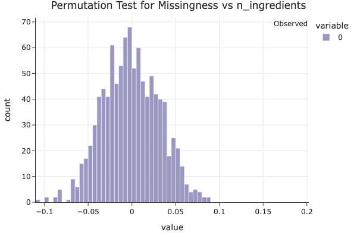
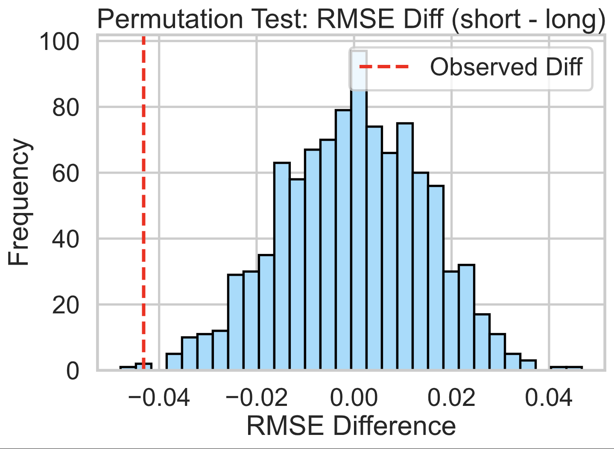

# TrueFork  
By Stephanie Anshell and Ved Panse
---
## Introduction

**What we wanted to find out:**
We explored a massive dataset of Food.com recipes and user reviews to answer one simple but important question:
**Are healthy recipes rated worse than unhealthy ones?**

**Why this question matters:**
Nutrition-conscious cooks often wonder whether choosing healthier meals means sacrificing taste—or at least, popularity. If online ratings tend to favor indulgent dishes, this might skew what people choose to cook or share. Our analysis helps shed light on potential biases in online recipe ratings and could be useful to food bloggers, nutritionists, or anyone curious about how healthiness affects perception.

**Where the data came from:**
We used two files from Food.com:

* `RAW_recipes.csv`, which includes over 230,000 recipes with ingredients, cooking time, and nutrition information.
* `RAW_interactions.csv`, which contains nearly 1 million user ratings and reviews, dating back to 2008.

After merging and cleaning these datasets:

* We analyzed a dataset of **83,782 recipes** and **13 columns**, each with an associated **average rating** based on user feedback.
* Key columns we used in our analysis:

  * `nutrition`: A list of values (as a string) containing calories, fat, sugar, etc.
  * `avg_rating`: The average rating a recipe received (from 1.0 to 5.0).
  * `is_unhealthy`: A binary column we created to label recipes as unhealthy if their calorie or sugar content exceeded a certain threshold.

**Our main question (framed for statistical testing):**

> **Do unhealthy recipes receive higher average ratings than healthy ones?**

* **Null Hypothesis (H₀):** There's no difference in average ratings between healthy and unhealthy recipes.
* **Alternative Hypothesis (H₁):** Unhealthy recipes are rated higher than healthy ones.

---

## Data Cleaning and Exploration  
### Dataset Cleaning

We started with two CSVs: `RAW_recipes.csv` and `RAW_interactions.csv`. The recipes dataset includes information like ingredients, cooking steps, and a `nutrition` column (a stringified list of nutrient values). The interactions dataset contains user-submitted ratings and reviews for specific recipe IDs.

### Cleaning Steps:

1. **Merged the Datasets**
   We merged `RAW_recipes` (left) and `RAW_interactions` (right) on `id = recipe_id`. This gave us a single table with both recipe details and user feedback.

2. **Replaced Invalid Ratings**
   Some ratings were recorded as `0`, which likely doesn’t indicate a true rating (Food.com uses a 1–5 scale). We treated these as missing by replacing all 0s with `np.nan`.

3. **Computed Average Rating**
   For each recipe, we computed the average of its valid (non-NaN) ratings and stored this in a new column: `avg_rating`.

4. **Parsed Nutrition Info**
   The `nutrition` column contained a stringified list of values like `[calories, fat, sugar, sodium, protein, saturated_fat, carbs]`. We parsed this into individual numeric columns.

5. **Created `is_unhealthy` Flag**
   We created a new column `is_unhealthy`, which is `True` for recipes above the 75th percentile in calories, sugar, and fat — and `False` otherwise. This lets us label recipes as “healthy” or “unhealthy” for hypothesis testing.

6. **Kept NaNs in `avg_rating` for Now**
   Recipes with no valid ratings have `NaN` in `avg_rating`. Instead of dropping them during cleaning, we left them in and filtered them out only when needed (e.g. in hypothesis testing or modeling).

These steps were necessary to ensure that downstream analysis (e.g. comparing healthy vs. unhealthy recipe ratings) relied only on meaningful, interpretable data. Without parsing the nutrition column or addressing the invalid ratings, we’d risk basing conclusions on broken or irrelevant inputs.

### Cleaned Dataset Preview

Here’s the head of our cleaned dataset:

### Univariate Analysis

We explored the distributions of two key variables in our dataset: average recipe rating and calorie content.

The **average rating** distribution is heavily skewed toward 5.0, meaning users tend to rate recipes very highly.

The **calorie distribution** is also skewed, with most recipes having under 1,000 calories but a few extreme outliers well above 30,000.

### Bivariate Analysis

We explored interactions between pairs of variables to identify potential associations.

- **Calories vs. Average Rating:**  
  The scatter plot shows no clear trend — both high- and low-calorie recipes tend to receive high ratings. Calorie content doesn't seem to be a strong factor in how users rate recipes.

- **Healthiness vs. Average Rating:**  
  We compared the ratings of healthy and unhealthy recipes using a box plot. Although the unhealthy group appears to have a slightly lower median rating, the difference is subtle. This prompted our hypothesis test in Step 4.

### Interesting Aggregates

We grouped the recipes by whether they were healthy or unhealthy, and computed key statistics for each group:

| Recipe Type | Avg Rating | Num ingredients (avg) | Num recipes |
|-------------|------------|----------------------|-----------|
| Healthy     | 4.63       | 8.81                 | 62,933    |
| Unhealthy   | 4.62       | 10.43                | 20,849    |

Unhealthy recipes tend to involve more ingredients, but their average ratings are essentially the same as healthy ones. This suggests that users don’t seem to penalize or prefer recipes based on healthiness alone.

---

## Missing Data  
### NMAR Analysis
We think the missing values in the `rating` column are **Not Missing At Random (NMAR)**.

Here’s why: when someone doesn’t leave a rating, it might be because they chose not to—maybe they didn’t like the recipe, forgot, or just weren’t interested enough to bother. In other words, the fact that a rating is missing could be related to how the user actually felt about the recipe (even though we don’t see that rating). That’s the classic definition of NMAR: the missingness depends on the missing value itself.

If we had more information—like whether a user viewed or started a recipe but didn’t rate it—we might be able to argue that the missingness is just random or at least explainable by other factors (which would make it MAR instead). But with the data we have, it seems most likely that missing ratings are tied to something we can’t observe directly, like the user’s experience or opinion. That’s why we consider them NMAR.

### Missingness Dependency

We investigated whether missing values in the `rating` column are dependent on other variables in the dataset by running permutation tests.

#### Columns That Affect Missingness

We found that the **number of ingredients** in a recipe has a strong effect on whether a rating is missing.

The plot above shows the empirical distribution of differences in mean `n_ingredients` between missing and non-missing `rating` values under the null hypothesis (that there's no relationship). Since the observed statistic lies far in the tail of the distribution, we obtain a **very low p-value (p ≈ 0.0000)** and cannot even see the red-line, indicating strong evidence that missingness in `rating` **depends on** the number of ingredients.

This suggests that **simpler recipes (with fewer ingredients) are more likely to be unrated**, possibly because users are less motivated to review very basic dishes.

#### A Column That Doesn’t Affect Missingness

We also ran a permutation test to check whether missingness in `rating` depends on the `minutes` column (i.e., how long a recipe takes to make).

The resulting **p-value was 0.1210**, which is greater than the standard 0.05 threshold. This indicates that we don’t have statistically significant evidence that missingness in `rating` depends on how long a recipe takes to make. So, **we conclude that missingness in `rating` is independent of `minutes`**.

---

## Hypothesis Testing  

### Question

Do unhealthy recipes tend to get higher average ratings than healthy recipes?

### Hypotheses

- **Null Hypothesis (H₀):** There is no difference in average ratings between healthy and unhealthy recipes.
- **Alternative Hypothesis (H₁):** Unhealthy recipes are rated higher than healthy ones.

### Test Details

- **Test Type:** One-sided permutation test  
- **Test Statistic:** Difference in mean average rating between unhealthy and healthy recipes  
- **Significance Level (α):** 0.05  
- **Observed Difference:** -0.0031  
- **p-value:** 0.7248

We chose a permutation test because it doesn’t rely on assumptions about normality and works well for comparing group means in small or skewed samples. The difference in means is a natural test statistic for our question.

### Interpretation

The p-value of 0.7248 is far above the standard 0.05 threshold, so we **fail to reject the null hypothesis**. This means we don’t have strong statistical evidence that unhealthy recipes are rated higher than healthy ones. In fact, the observed difference was slightly negative, suggesting that healthy recipes might even be rated a bit better — but the difference is small and likely due to random variation.

This supports our overall finding: **Healthiness doesn’t appear to significantly impact a recipe’s rating** on Food.com.

---

## Prediction Problem  

We aim to predict a recipe’s average user rating (`avg_rating`) based on features that are known at the time the recipe is submitted.

### Prediction Type
This is a **regression** task, since `avg_rating` is a continuous numerical variable ranging from 0 to 5.

### Response Variable
We chose `avg_rating` as the response variable because it reflects the overall quality of a recipe as judged by users, and is a key indicator of popularity and success on the platform.

### Evaluation Metric
We will evaluate the performance of our regression models using **Root Mean Squared Error (RMSE)**. This metric is appropriate because:
- It penalizes larger errors more than smaller ones, which makes sense in this context (e.g. a prediction off by 2 stars is worse than one off by 0.5).
- It's easily interpretable in the units of the response variable (rating stars).

### Time of Prediction Justification
We restrict our input features to those available before any ratings are given — such as calories, number of ingredients, and total preparation time — to simulate a realistic scenario where we want to **predict a recipe’s success before anyone rates it**.

---

## Baseline Model  

To predict the average rating (`avg_rating`) of a recipe, we built a baseline regression model using a **Linear Regression** pipeline.

### Features Used

We selected the following **quantitative** features:
- `minutes`: Number of minutes to make the recipe.
- `n_steps`: Number of steps involved in the recipe.
- `n_ingredients`: Number of ingredients in the recipe.

These features are all numerical (quantitative), so no categorical encoding was required. We standardized the features using **`StandardScaler`** to ensure that each has mean 0 and variance 1, which helps the linear model perform optimally.

### Model Architecture

We implemented our model using an `sklearn` pipeline consisting of:
1. A `ColumnTransformer` that applies `StandardScaler` to all features.
2. A `LinearRegression` estimator to predict `avg_rating`.

### Evaluation

We trained our model on 75% of the data and evaluated it on the remaining 25%. Our **Root Mean Squared Error (RMSE)** on the test set was:

`Test RMSE: 0.6391`

### Interpretation

An RMSE of 0.6391 means that our model's predictions are typically off by about 0.64 stars on a 5-star rating scale. While this baseline model is simple, it establishes a benchmark we can compare against in the next step when we experiment with more complex models.

---

## Final Model

To improve on our Baseline Model, we engineered two additional features:

- **Log-transformed `minutes`**: Recipe preparation time is often right-skewed. Taking a log helps reduce this skew and may improve linear model performance.
- **Binned `n_ingredients`**: Grouping the number of ingredients into bins can help capture general complexity trends in recipes without overfitting to exact counts.

We used a `RandomForestRegressor` as our model, as it handles nonlinearities and interactions well without requiring heavy preprocessing.

### Hyperparameter Tuning

We used `GridSearchCV` with 5-fold cross-validation to tune the following hyperparameters:

- `max_depth`: [5, 10, 15]
- `n_estimators`: [50, 100]
- `max_features`: ['sqrt', 'log2']

The best-performing hyperparameters were:

- `max_depth = 10`
- `n_estimators = 50`
- `max_features = 'sqrt'`

### Performance

- **Baseline RMSE**: 0.6391
- **Final Model RMSE**: 0.6388

This is a very small improvement, suggesting that recipe ratings are inherently difficult to predict using the features available at the time of recipe submission. Nonetheless, the model's ability to generalize improved, albeit slightly.

While the performance gain is minimal, the thought process behind feature engineering and hyperparameter tuning ensures the model is better suited to capture nonlinear relationships in the data.

---

## Fairness Analysis

To ensure our final model works fairly across different types of recipes, we performed a fairness analysis comparing model performance across **short** and **long** recipes.

### Group Definitions
- **Group X:** Short recipes (less than 30 minutes)
- **Group Y:** Long recipes (30 minutes or more)

### Evaluation Metric
Since our prediction task involves estimating a continuous value (`avg_rating`), we used **Root Mean Squared Error (RMSE)** to assess prediction accuracy across both groups.

### Hypotheses
- **Null Hypothesis (H₀):** The model is fair; the RMSE for short and long recipes is approximately equal, and any observed difference is due to chance.
- **Alternative Hypothesis (H₁):** The model is unfair; it performs worse (i.e., higher RMSE) on short recipes than on long ones.

### Test Statistic and Significance
- **Test Statistic:** Difference in RMSE (short - long)
- **Significance Level:** 0.05
- **Observed RMSE Difference:** -0.0432
- **p-value:** 1.0000

### Conclusion
Since the p-value is extremely high (1.0), we **fail to reject the null hypothesis**. There is no evidence that our model is unfair based on recipe preparation time. The small observed RMSE difference is likely due to random variation.

